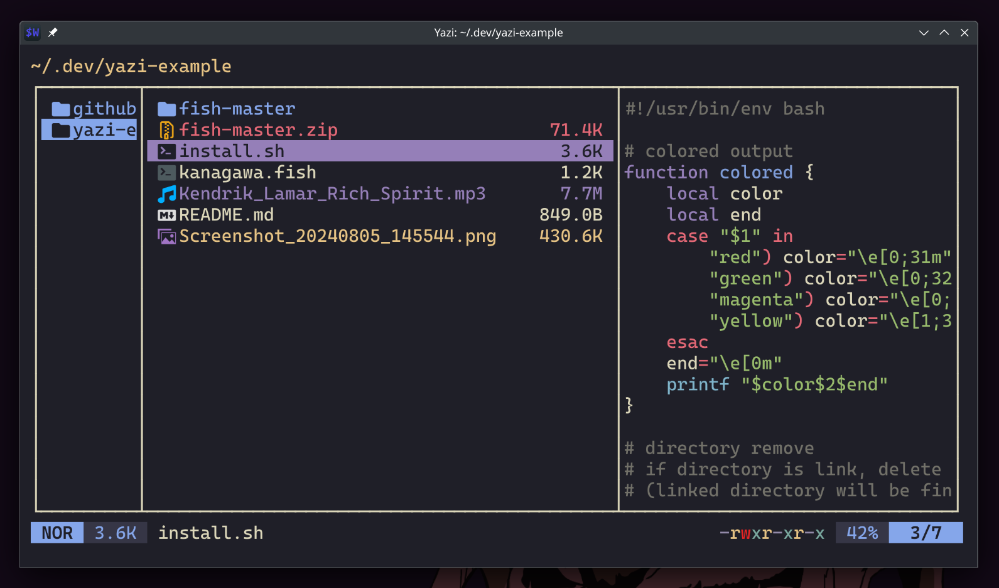

<div align="center">
  
</div>

<h3 align="center">
    Kanagawa Flavor for <a href="https://github.com/sxyazi/yazi">Yazi</a>
</h3>

## 👀 Preview



## 🎨 Installation

```bash
ya pack -a dangooddd/kanagawa
```

## ⚙️ Usage

> [!Note]
> To achieve the look like in the screenshot you also need to install
> [full-border](https://github.com/yazi-rs/plugins/tree/main/full-border.yazi) plugin!

Add these lines to your `theme.toml` configuration file to use it:

```toml
[flavor]
dark = "kanagawa"
```

## 📜 License

The flavor is MIT-licensed, and the included tmTheme is also MIT-licensed.

Check the [LICENSE](LICENSE) and [LICENSE-tmtheme](LICENSE-tmtheme) file for more details.
