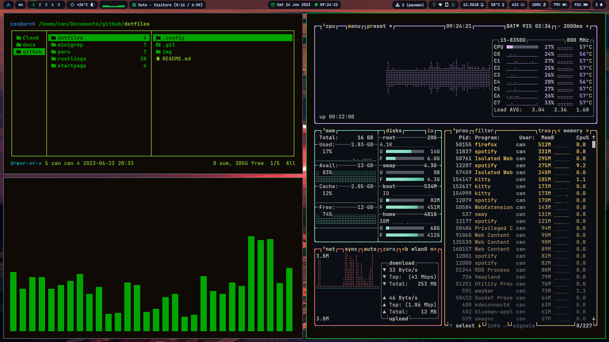

# Arch Linux Dotfiles

dotfiles are the files that starts wth a . (dot). This files are generally responsible for software configurations. This repository contains my favorite and most used dotfiles in my Arch Linux setup.

| **Module Type**     | **Module Name**                                                                            |
|:------------------- |:------------------------------------------------------------------------------------------:|
| Shell               | [fish-shell](https://github.com/fish-shell/fish-shell)                                     |
| Promt Theme Engine  | [starship](https://github.com/starship/starship)                                           |
| Window Manager      | [sway](https://github.com/swaywm/sway)                                                     |
| Notification Deamon | [swaync](https://github.com/ErikReider/SwayNotificationCenter)                             |
| Screen Locker       | [swaylock-effects](https://github.com/mortie/swaylock-effects)                             |
| Status Bar          | [waybar](https://github.com/Alexays/Waybar)                                                |
| System Into Tool    | [neofetch](https://github.com/dylanaraps/neofetch)                                         |
| Terminal            | [kitty](https://github.com/kovidgoyal/kitty)                                               |
| Display Manager     | [ly](https://github.com/fairyglade/ly)                                                     |
| File Manager        | [ranger](https://github.com/ranger/ranger) [thunar](https://github.com/xfce-mirror/thunar) |
| Text Editor         | [nvim](https://github.com/neovim/neovim), [vscodium](https://github.com/VSCodium/vscodium) |
| App Launcher        | [fuzzel](https://codeberg.org/dnkl/fuzzel)                                                 |

## Screenshots

