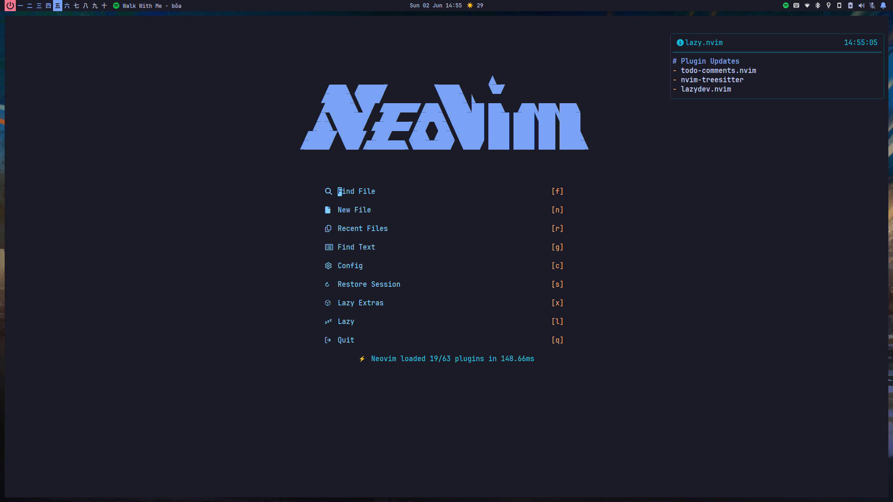

# Arch Linux Dotfiles

dotfiles are the files that starts with a . (dot). This files are generally responsible for software configurations. This repository contains my favorite and most used dotfiles in my Arch Linux setup. 

For wallpapers you can check [my other repo](https://www.github.com/lvntcnylmz/wallpapers).

[Screenshots](#screenshots) are somewhere down there.

| **Module Type**     |                        **Module Name**                         |
| :------------------ | :------------------------------------------------------------: |
| Window Manager      |             [sway](https://github.com/swaywm/sway)             |
| Terminal            |             [foot](https://codeberg.org/dnkl/foot)             |
| Status Bar          |          [waybar](https://github.com/Alexays/Waybar)           |
| Display Manager     |             [ly](https://github.com/fairyglade/ly)             |
| Text Editor         |            [nvim](https://github.com/neovim/neovim)            |
| Shell               |     [fish-shell](https://github.com/fish-shell/fish-shell)     |
| App Launcher        |           [fuzzel](https://codeberg.org/dnkl/fuzzel)           |
| File Manager        |             [yazi](https://github.com/sxyazi/yazi)             |
| Promt Theme Engine  |        [starship](https://github.com/starship/starship)        |
| Notification Deamon | [swaync](https://github.com/ErikReider/SwayNotificationCenter) |
| Screen Locker       | [swaylock-effects](https://github.com/mortie/swaylock-effects) |
| System Info Tool    |    [fastfetch](https://github.com/fastfetch-cli/fastfetch)     |
| Resource Monitor    |          [btop](https://github.com/aristocratos/btop)          |

## Installation

There is no installation script yet, but in the meantime you can clone the repo and copy the contents of the `./config` folder into your `./config` folder.

<u>Example</u>:

```
git clone https://github.com/lvntcnylmz/dotfiles.git
cp -r dotfiles/.config/* ~/.config
```

### TODO

- [ ] Add installation script
- [ ] Better documentation

## Screenshots



