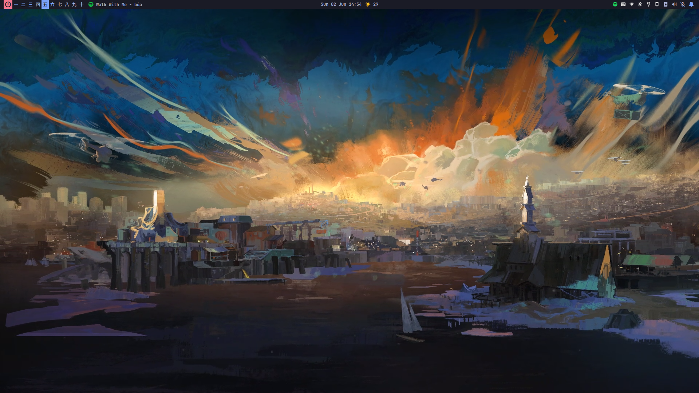
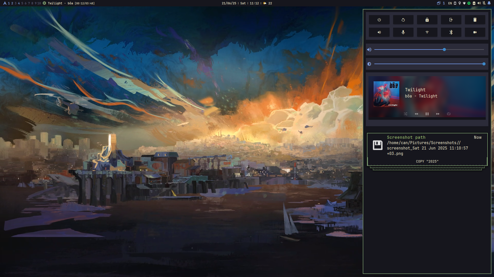
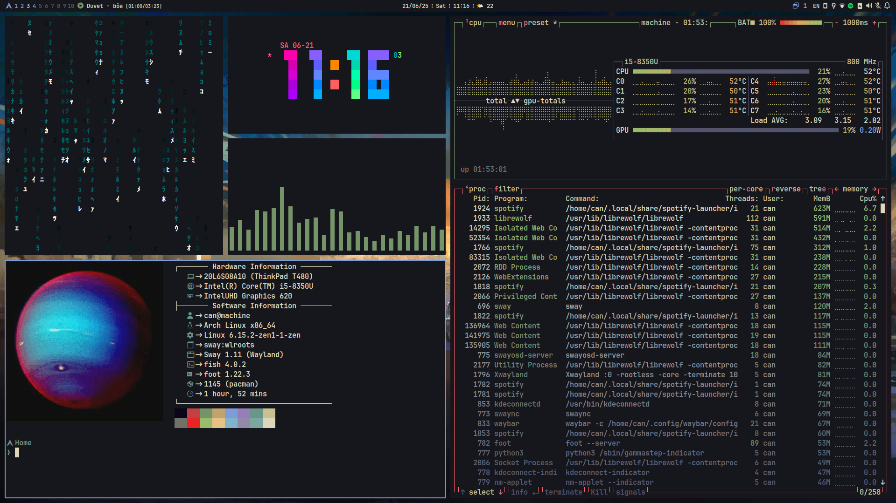
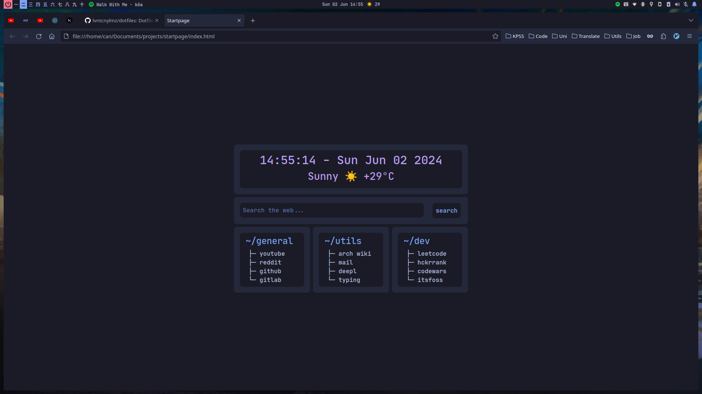
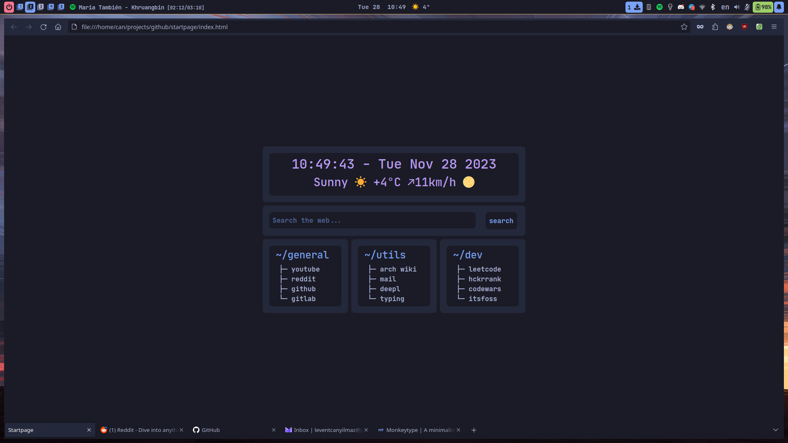

# Arch Linux Dotfiles

dotfiles are the files that starts with a . (dot). This files are generally responsible for software configurations. This repository contains my favorite and most used dotfiles in my Arch Linux setup.

[Screenshots](#screenshots) are somewhere down there.

| **Module Type**     | **Module Name**                                                                                                                                |
|:--------------------|:----------------------------------------------------------------------------------------------------------------------------------------------:|
| Shell               | [fish-shell](https://github.com/fish-shell/fish-shell)                                                                                         |
| Promt Theme Engine  | [starship](https://github.com/starship/starship)                                                                                               |
| Window Manager      | [sway](https://github.com/swaywm/sway)                                                                                                         |
| Notification Deamon | [swaync](https://github.com/ErikReider/SwayNotificationCenter)                                                                                 |
| Screen Locker       | [swaylock-effects](https://github.com/mortie/swaylock-effects) </br> [swaylock-corrupter](https://github.com/aur-packaging/swaylock-corrupter) |
| Status Bar          | [waybar](https://github.com/Alexays/Waybar)                                                                                                    |
| System Info Tool    | [neofetch](https://github.com/dylanaraps/neofetch) </br> [btop](https://github.com/aristocratos/btop)                                          |
| Terminal            | [kitty](https://github.com/kovidgoyal/kitty)                                                                                                   |
| Display Manager     | [ly](https://github.com/fairyglade/ly)                                                                                                         |
| File Manager        | [ranger](https://github.com/ranger/ranger) </br> [thunar](https://github.com/xfce-mirror/thunar)                                               |
| Text Editor         | [nvim](https://github.com/neovim/neovim)                                                                                                       |
| App Launcher        | [fuzzel](https://codeberg.org/dnkl/fuzzel)                                                                                                     |
| GTK Theme           | [Tokyo Night GTK](https://github.com/Fausto-Korpsvart/Tokyo-Night-GTK-Theme)                                                                   |
| Icon Theme          | [Flatery Dark](https://github.com/cbrnix/Flatery)                                                                                              |
| Cursor Theme        | [Simp1e Tokyo Night](https://gitlab.com/cursors/simp1e)                                                                                        |

## Installation

There is no installation script yet, but in the meantime you can clone the repo and copy the contents of the `./config` folder into your `./config` folder. 

<u>Example</u>:

```
git clone https://github.com/lvntcnylmz/dotfiles.git
cp -r dotfiles/.config/* ~/.config
```

## Screenshots












